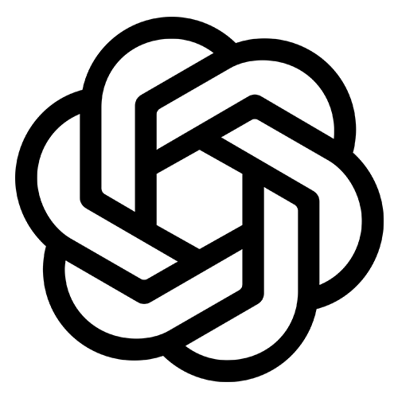

<h1> Welcome to my GitHub profile!</h1>

<table>
  <tr>
    <!-- Left side: About Me text -->
    <td align="left" width="60%">
    
### Hi, I'm Mostafizur Rahman 👋

I'm a Data Scientist, Deep Learning enthusiast, and lifelong learner.  
I love solving real-world problems with Python, ML, and AI.  
Currently exploring NLP, Computer Vision, and MLOps.  

- Currently working on Machine Learning & Deep Learning projects  
- Learning new skills daily in AI and Data Engineering  
- Passionate about data, algorithms, and efficient pipelines  
- Always seeking challenges that push my limits  

    </td>

    <!-- Right side: GIF -->
    <td align="center" width="40%">
      
    </td>
  </tr>
</table>

<h2>Languages & Tools</h2>

[][python]
[][pandas]
[][numpy]
[][matplotlib]
[][seaborn]
[][plotly]
[][scikit-learn]
[][pytorch]
[][jupyter]
[][colab]
[][vscode]
[][openai]
[][github]
[][anaconda]
[][excel]

[python]: https://www.python.org/
[pandas]: https://pandas.pydata.org/
[numpy]: https://numpy.org/
[matplotlib]: https://matplotlib.org/
[seaborn]: https://seaborn.pydata.org/
[plotly]: https://plotly.com/python/
[scikit-learn]: https://scikit-learn.org/stable/
[pytorch]: https://pytorch.org/
[jupyter]: https://jupyter.org/
[colab]: https://colab.research.google.com/
[vscode]: https://code.visualstudio.com/
[openai]: https://openai.com/
[github]: https://github.com/
[excel]: https://www.microsoft.com/en-us/microsoft-365/excel/
[anaconda]: https://www.anaconda.com/
[excel]: https://www.microsoft.com/en-us/microsoft-365/excel/

 

<h2>Connect with me </h2>

[][linkedin]
[][kaggle]
[][gmail]

 

[linkedin]: https://www.linkedin.com/in/mostafizrahman10/
[kaggle]: https://www.kaggle.com/mrafraim
[gmail]: mailto:mostafiz.r.afraim@gmail.com

